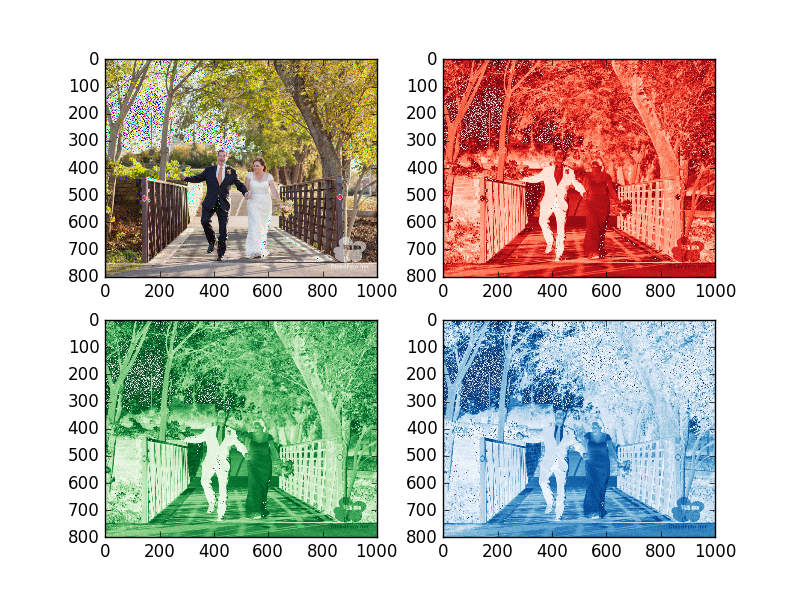
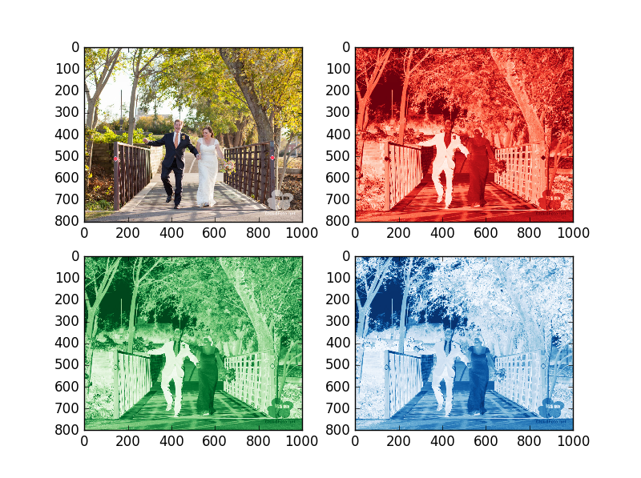

UECM3033 Assignment #2 Report
========================================================

- Prepared by: Lye Jia Wei
- Tutorial Group: T2

--------------------------------------------------------

## Task 1 --  $LU$ Factorization or SOR method

The reports, codes and supporting documents are to be uploaded to Github at: 

https://github.com/lyejiawei/UECM3033_assign2

In this task of assignment, the definition of the function (lu,sor,solve) is modified. The function of lu is defined by setting the pivot element and pivot row.Then,the pivot row and pivot element is updated. Next, the index vector is updated. Appropriate columns of row k in A store opposite of multiplier is updated. As a result, the factorized matrix is returned by LU method. 

On the other hand, the function of sor is defined by creating iteration of matrix. Then, each row is transformed. Next, the right-hand side vector is scaled. Solution vector is set equal to initial estimate. As a result, the factorized matrix is returned by SOR method. 

For the solve function, condition for choosing SOR or LU method is set by checking the coefficient of matrix A is positive definite and all the diagonal elements are positive. If the coefficient of matrix A is positive definite, and has positive diagonal elements, and the omega chosen is in the range (0, 2), then the solution by SOR iterations will be converged. However, LU method is does not have any special condition for using it to solve a linear system. Therefore, LU decomposition is more preferred in most of the time.

The solution of the first linear system is: x = [1.0,1.0,1.0]^T
The solution of the second linear system is x = [1,-1,4,-3.5,,7,-1]^T
The answers are checked by multiply the solution matrix with A, and see whether the result is approximate to the right hand side, B.

---------------------------------------------------------

## Task 2 -- SVD method and image compression

My original picture file (mypicture.jpg)

There are 800 non-zero elements in $\Sigma$ as the total elements is 800.

My lower resolution of picture files (mypicture_lowresolution.png)

My higher resolution of picture files (mypicture_highresolution.png)

In this task of assignment, firstly the picture that I have been chosen is read. Then, the red(r), green (g), blue (b) arrays is generated. Next, U, sigma, and V for red, green and blue matrix is generated respectively with r1=U, r2=sigma, r3=V. The number of non-zero elements in each colour of decompose sigma is checked and print out. First n-term of non-zero elements is kept. By creating diagonal matrix to perform dot multiplication, the dimension of r2 to (800, 1000) is changed since original r2 from linalg.svd is (800, 1). Next, dot multiplication is performed to create lower resolution pictures. As the result, two groups of four pictures will be plotted. Each group of pictures contain the original colour, red, green, and blue. The first group of picture is the original set while the second group of picture is the lower resolution set.

In general, sparse matrix is a matrix which most of the element is zero. For our case, after we keep the first 30 non-zero elements and set other elements to be zero, we change the dimension of the sigma from (800, 1) to (800, 1000) which created a sparse matrix of (800, 1000) dimension matrix. This matrix is used for dot multiplication as mention above. This eventually used to create the lower resolution pictures as most elements in sparse matrix are zero.

-----------------------------------

last modified: 10/3/2016

